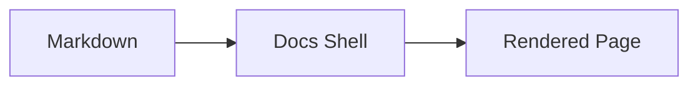

## Purpose

Show the diagram formats the docs shell can render, so authors can pick one and
copy a working sample. This page doubles as a visual test: if the shell renders
correctly, both diagrams below appear as themed graphics in light and dark mode.

## Primary Section

The shell supports two portable diagram formats. Prefer these over raw inline SVG,
which the shell renders but most git hosts strip from the repo Markdown view.

- **Mermaid** — a fenced `mermaid` code block. Lowest authoring effort; the shell
  themes it to the docs palette, and git hosts render it natively.
- **Referenced SVG** — a standalone `.svg` in `assets/diagrams/` linked as an
  image. Full manual layout control; travels with the file everywhere.

## Structured Data

| Format | Renders in shell | Renders in git repo view | Layout control |
|--------|------------------|--------------------------|----------------|
| Mermaid | Yes, themed | Yes, host's own theme | Auto (limited) |
| Referenced SVG | Yes, framed | Yes, as a bare image | Full, manual |
| Inline SVG | Yes | No (stripped) | Full, manual |

## Embedded HTML Example

The same flow, authored as mermaid:

And as a referenced SVG, copied from `templates/diagram-template.svg` and themed to
match:

## Notes

Both formats share one palette, so a mermaid diagram and a referenced SVG look the
same in the shell. On a git host they diverge: mermaid uses the host's theme, and
the referenced SVG keeps documenter's palette but loses its card frame.

Inline SVG (the `diagram-frame` pattern) still renders in the shell but is stripped
by most git hosts, so reserve it for shell-only docs.

Writing rules are defined in [Documentation Style Guide](./documentation-style-guide.md).
Platform behavior is defined in [Documentation Architecture](./documentation-architecture.md).
Requirements for new pages are defined in [Documentation Markdown Contract](./documentation-md-contract.md).
