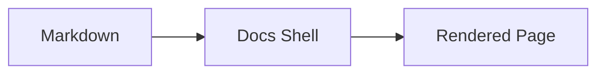

## Purpose

Show the diagram formats the docs shell can render, so authors can pick one and
copy a working sample. This page doubles as a visual test: if the shell renders
correctly, all three diagrams below appear as themed graphics in light and dark mode.

## Primary Section

Three diagram formats are supported. **Mermaid is the preferred default** — it is
human-readable and diffable, and both it and referenced SVGs render in the shell
*and* natively on Git hosts. Inline SVG renders only in the shell.

- **Mermaid (preferred)** — a fenced `mermaid` code block. Lowest authoring effort;
  the shell themes it to the docs palette, and Git hosts render it natively.
- **Referenced SVG** — a standalone `.svg` in `assets/diagrams/` linked as an
  image. Full manual layout control; travels with the file everywhere.
- **Inline SVG** — the `diagram-frame` wrapper. Supported, but renders only in the
  shell (Git hosts strip it).

## Structured Data

| Format | Renders in shell | Renders in git repo view | Layout control |
|--------|------------------|--------------------------|----------------|
| Mermaid | Yes, themed | Yes, host's own theme | Auto (limited) |
| Referenced SVG | Yes, framed | Yes, as a bare image | Full, manual |
| Inline SVG | Yes | No (stripped) | Full, manual |

## Embedded HTML Example

The same flow, authored as mermaid:

And as a referenced SVG, copied from `templates/diagram-template.svg` and themed to
match:

And as inline SVG (`diagram-frame`), which renders in the shell only:

  <svg viewBox="0 0 640 120" role="img" aria-labelledby="inline-flow-title">
    <title id="inline-flow-title">Markdown to docs shell to rendered page</title>
    <defs>
      <marker id="inline-flow-arrow" markerWidth="10" markerHeight="8" refX="9" refY="4" orient="auto">
        <path d="M 0 0 L 10 4 L 0 8 z" fill="rgba(100, 116, 139, 0.9)" />
      </marker>
    </defs>
    <rect class="diagram-node" x="20" y="35" width="150" height="50" rx="8" />
    <text class="diagram-label" x="95" y="65" text-anchor="middle">Markdown</text>
    <rect class="diagram-node" x="245" y="35" width="150" height="50" rx="8" />
    <text class="diagram-label" x="320" y="65" text-anchor="middle">Docs Shell</text>
    <rect class="diagram-node" x="470" y="35" width="150" height="50" rx="8" />
    <text class="diagram-label" x="545" y="65" text-anchor="middle">Rendered Page</text>
    <path class="diagram-arrow" marker-end="url(#inline-flow-arrow)" d="M 170 60 L 240 60" />
    <path class="diagram-arrow" marker-end="url(#inline-flow-arrow)" d="M 395 60 L 465 60" />
  </svg>
  
Inline SVG renders in the shell but is stripped on Git hosts.

## Notes

Both formats share one palette, so a mermaid diagram and a referenced SVG look the
same in the shell. On a git host they diverge: mermaid uses the host's theme, and
the referenced SVG keeps documenter's palette but loses its card frame.

Inline SVG (the `diagram-frame` pattern) still renders in the shell but is stripped
by most git hosts, so reserve it for shell-only docs.

Writing rules are defined in [Documentation Style Guide](./documentation-style-guide.md).
Platform behavior is defined in [Documentation Architecture](./documentation-architecture.md).
Requirements for new pages are defined in [Documentation Markdown Contract](./documentation-md-contract.md).
