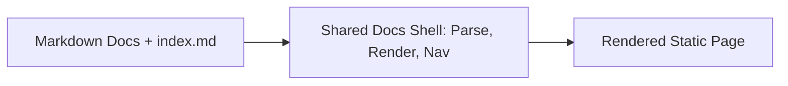
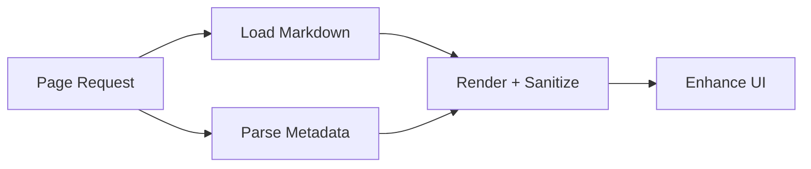
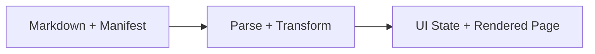

## Overview

The documentation system provides a repo-local docs experience that works in static environments and remains readable as source markdown. It exists so documentation can be reviewed, versioned, and maintained directly in Git without requiring a hosted docs platform.

At runtime, a shared shell loads markdown pages, reads frontmatter metadata, renders content safely, and builds consistent navigation and page chrome.

*High-level context for the documentation platform.*

## Goals

- Keep documentation usable directly from the repository in static hosts.
- Keep docs navigation deterministic and versioned from source.
- Keep document rendering safe while allowing architecture diagrams and rich markdown content.
- Keep docs easy to update by humans and AI agents without custom tooling.

## Non-goals

- This system is not a documentation CMS.
- This system does not auto-generate architecture or process diagrams.
- This system does not replace ADRs for long-form design history.

## Design Constraints

- The docs experience must work without a server-side runtime.
- Documents must remain maintainable as markdown source files.
- Shell rendering depends on browser-safe vendored libraries.
- Navigation must be explicit and sourced from `docs/index.md`.

## Key Decisions

### Use markdown documents with frontmatter as the content source

**Decision:** Each page is authored as a markdown file with frontmatter metadata.

**Rationale:** This keeps documents readable in source form and reviewable in standard Git workflows.

### Build navigation from `docs/index.md`

**Decision:** The shell uses links declared in `docs/index.md` as the navigation manifest.

**Rationale:** The docs runtime is fully client-side in static environments, so it cannot reliably enumerate repository files at runtime without server-side support. A manually managed manifest is required for deterministic discoverability.

**Rejected alternatives:**

| Alternative | Why it was rejected |
|---|---|
| Auto-discover all `docs/**/*.md` files | Not technically viable in the current client-side/static-host model because browser runtime cannot list repo files directly. |

### Use markdown source files instead of authoring docs as HTML

**Decision:** Documentation pages are authored as markdown with frontmatter rather than full HTML source documents.

**Rationale:** Markdown keeps source lighter for both humans and AI agents. In this repository, markdown authoring reduced token usage by roughly 50% compared with equivalent HTML content, which materially improves AI-driven authoring and review workflows.

### Vendor browser libraries into `docs/assets/vendor/`

**Decision:** The docs runtime uses vendored browser builds for markdown parsing, sanitization, and YAML parsing.

**Rationale:** Static hosts and local preview environments cannot rely on runtime package resolution from `node_modules`.

## System Boundaries

### Owned by this system

- Shell behavior that loads, parses, and renders markdown docs in browser runtime.
- Navigation and grouping behavior derived from frontmatter and manifest links.
- Shared docs visual system and layout behavior.

### Not owned by this system

- Product runtime behavior outside documentation pages.
- Application architecture decisions unrelated to docs platform behavior.
- External hosted documentation infrastructure.

### Depends on but does not control

- Browser runtime behavior and DOM APIs.
- Vendored third-party parser/sanitizer libraries.
- Author quality and consistency of frontmatter and document content.

## System Operation

### Owned Processes

The documentation platform is authoritative for page loading, rendering, navigation assembly, and table-of-contents generation.

*Owned runtime workflow for docs shell page rendering.*

### Process: Shell-mode page rendering

**Purpose:** Render a selected markdown document into the shared documentation shell.

**Trigger:** The browser loads `docs/index.html` with `data-shell="true"` and a page slug hash.

**High-level flow:**

1. Resolve slug from `location.hash` and fetch the matching markdown page.
2. Parse YAML frontmatter for document metadata.
3. Render markdown to HTML, sanitize output, and mount content.
4. Build navigation and table of contents from manifest and headings.

**Important design notes:**

- Rendering enhancement does not change markdown as source of truth.
- Sanitization allows safe rich content, including inline SVG markup.
- Diagrams may be authored as Mermaid (preferred), a referenced SVG image, or inline SVG. Mermaid is rendered client-side after sanitization; inline SVG renders only in the shell, while Mermaid and referenced SVGs also render on Git hosts.

### Owned Data

The documentation platform owns the meaning and usage rules for manifest links and page-level metadata in shell mode.

| Data | Why it exists | Ownership notes |
|---|---|---|
| `docs/index.md` navigation links | Define which pages exist in shell navigation and in what order | The shell reads this as manifest input; pages are navigable only when linked here |
| Page frontmatter (`title`, `section`, `description`) | Provide metadata for grouping, labeling, and page context | Authors provide values; shell behavior depends on consistency |
| Derived heading map (`h2`/`h3`) | Build page-local table of contents for scanability | Generated from rendered content at runtime |

### Data Flows

Meaningful data movement centers on markdown content, frontmatter metadata, and manifest links flowing into rendered shell UI.

*Data flow from repo source to rendered docs shell output.*

### Flow: Loading a shell-mode documentation page

1. Browser loads shell runtime and selected page slug.
2. Shell fetches markdown source for the selected page.
3. Frontmatter and body are parsed and transformed.
4. Manifest links and metadata produce navigation and grouping.
5. Rendered content and derived heading map produce final page and table of contents.

### Flow notes

- A page participates in shell navigation only when linked from `docs/index.md`.
- Heading structure directly affects table-of-contents quality and behavior.

## Integration Points

| Integration | Direction | Purpose | Notes |
|---|---:|---|---|
| `docs/assets/app.js` | Runtime read/execute | Implements shell loading, parsing orchestration, navigation, and TOC behavior | Primary runtime entry point for docs shell behavior |
| `docs/assets/style.css` | Runtime read | Provides shared docs layout and visual behavior | Defines responsive shell presentation |
| `docs/assets/vendor/*.js` | Runtime read/execute | Provides browser-safe parsing and sanitization libraries | Synced by `scripts/sync-docs-vendor.mjs` |
| `docs/index.md` | Runtime read | Supplies navigation manifest links | Controls page discoverability in shell mode |
| `docs/**/*.md` | Runtime read | Supplies page content and frontmatter metadata | Source of truth for document content |

## Important Behaviors

### Shell-mode discoverability is manifest-driven

A markdown page exists in shell navigation only when linked from `docs/index.md`. This keeps inclusion explicit and avoids accidental navigation growth.

### TOC behavior is heading-driven

The right-side TOC is derived from `h2` and `h3` headings. Heading quality and hierarchy are an authoring concern with direct runtime impact.

### Template onboarding follows existing platform behavior

Template documents participate in the documentation platform through the same content and discoverability model as other markdown pages.

- A template becomes shell-discoverable when it is linked in `docs/index.md`.
- The shell treats template files as standard markdown content sources.
- Structural and linking compliance for template onboarding is governed by [Documentation Markdown Contract](./documentation-md-contract.md).

### Layout is responsive by platform design

Large screens render nav, content, and TOC in separate columns. Narrow screens collapse to a single-column layout with collapsed navigation controls.

## Runtime Sequences

Intentionally empty: no architecture-critical runtime sequences currently identified.

## Observability and Debugging

### How to inspect the system

- Open `docs/index.html` in a static preview and verify page loading from hash slug.
- Confirm frontmatter values are parsed and reflected in page title, section grouping, and description surfaces.
- Verify navigation presence and ordering by checking links in `docs/index.md`.
- Validate TOC behavior by checking `h2` and `h3` output in rendered content.

### Useful debugging surfaces

| Surface | Use |
|---|---|
| Browser dev tools | Inspect fetches, runtime state, rendered DOM, and script execution behavior |
| `docs/assets/app.js` | Verify shell orchestration, parsing flow, TOC generation, and nav behavior |
| `docs/index.md` | Verify manifest links, ordering, and shell-mode discoverability |
| Markdown page frontmatter | Verify metadata used for grouping and document context |

## Known Limitations

- Navigation inclusion depends on manifest linkage, so unlinked pages remain invisible in shell mode even when files exist.
- Runtime behavior depends on vendored browser builds; dependency upgrades require explicit vendor sync to avoid drift.

## Open Questions

Intentionally empty: no meaningful unresolved architecture questions currently identified.

## Notes

Intentionally empty: no meaningful notes currently identified.
