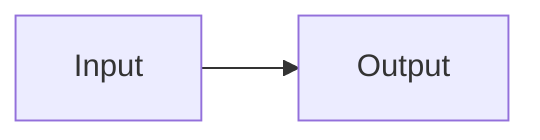

## Purpose

This contract defines required structure and authoring rules for Markdown documentation pages in `docs/`.
It exists so shell rendering, navigation, and lint behavior remain deterministic across human and AI-authored docs.

## Scope

### In scope

- Markdown docs consumed by the shared docs shell.
- Frontmatter, heading, linking, and allowed raw-HTML authoring requirements.
- Template declaration and template-section compliance requirements.

### Out of scope

- Runtime architecture behavior outside docs rendering.
- Writing quality guidance covered by [Documentation Style Guide](./documentation-style-guide.md).

## Contract Summary

| Area | Contract |
|---|---|
| Frontmatter | Docs pages must include `title`, `section`, `description`, and `template` when required. |
| Body structure | Body headings start at H2, and only H2/H3 are allowed in body content. |
| Linking/discovery | Docs use relative `./` links that must resolve to an existing file, and shell-visible docs must be listed in `docs/index.md`. |

## Required Structure

Every docs source file is a `.md` file with top-level YAML frontmatter followed by Markdown body content.

```text
---
title: Page Title
section: Section Name
description: One sentence describing the document scope.
template: ./templates/standard-template.md
---

## First Heading

Document content starts here.
```

Rules:

- Filenames use lowercase kebab-case.
- Use frontmatter title instead of a body H1 heading.
- Start body headings at H2.

## Required Fields

| Field | Required | Purpose | Notes |
|---|---:|---|---|
| `title` | Yes | Page title for shell UI and browser title | Non-empty string |
| `section` | Yes | Docs navigation grouping label | Reuse existing sections when appropriate |
| `description` | Yes | One-line page scope summary | Single line, maximum 180 chars |
| `template` | Yes, except `docs/index.md` and `docs/templates/*.md` | Declares template source used for section enforcement | Relative `.md` path in `docs/`, e.g. `./templates/contract-template.md` |

## Allowed Patterns

### Pattern: diagrams

**Use when:** A diagram communicates structure, flow, or sequence more clearly than prose or a table.

Three formats are supported. Prefer them in this order.

**1. Mermaid (preferred).** A fenced `mermaid` code block — human-readable, diffable, and rendered both in the docs shell and natively on most Git hosts (GitHub, Gitea).

~~~text

~~~

**2. Referenced SVG.** A standalone `.svg` under `docs/assets/diagrams/`, linked as an image. Use it when you need manual layout that Mermaid's auto-layout cannot give; it also renders in the shell and on Git hosts. Copy `templates/diagram-template.svg` as a themed, dark-mode-aware starter.

~~~text

~~~

Keep a referenced SVG **self-contained**: it loads as an ``, so it cannot inherit the shell's CSS. Its internal `<style>` block — palette, fonts, and `prefers-color-scheme` dark-mode rules — is what makes it match the theme and adapt to light/dark, and it must stay in the file. Edit the shapes, not that block. This is also why the SVG renders correctly on Git hosts, which never run the shell's CSS.

**3. Inline SVG.** The `diagram-frame` wrapper. Still supported, but it renders **only in the docs shell** — most Git hosts strip inline SVG from the Markdown view — so reserve it for shell-only docs.

~~~text
<div class="diagram-frame">
  <svg ...>...</svg>
  <div class="diagram-caption">...</div>
</div>
~~~

**Notes:**

- Allowed inline-SVG shared classes are `diagram-frame`, `diagram-node`, `diagram-arrow`, `diagram-label`, and `diagram-caption`.
- Keep raw HTML limited to the approved inline-SVG pattern; prefer Mermaid or a referenced SVG.

## Prohibited Patterns

| Prohibited pattern | Why it is prohibited |
|---|---|
| Body H1 headings | Conflicts with shell title rendering from frontmatter |
| Hash-route links in markdown | Breaks docs-link normalization rules; use relative `.md` links |
| Links to nonexistent docs files | Signals a stale reference left behind by a rename or delete; breaks navigation |
| Raw `&lt;script&gt;` and unapproved HTML tags/classes | Violates docs safety and shared rendering constraints |

## Processing Behavior

### Behavior: shell page render pipeline

1. Runtime fetches markdown source by selected slug.
2. Runtime parses YAML frontmatter and markdown body.
3. Runtime sanitizes HTML and mounts rendered content.

**Result:** Page renders with shell metadata, navigation, and TOC context.

**Contract implication:** Invalid structure or metadata causes lint failures and/or degraded shell behavior.

## Validation Rules

| Rule | Enforcement | Failure behavior |
|---|---|---|
| Required frontmatter fields and frontmatter constraints | `npm run docs:lint` | Command exits non-zero with field-specific errors |
| Template declaration and exact H2 template sequence | `npm run docs:lint` | Command exits non-zero with expected vs actual heading sequence |
| Index/doc sync, link policy, and HTML policy | `npm run docs:lint` | Command exits non-zero with line-level violations |
| Internal link targets resolve to an existing file | `npm run docs:lint` | Command exits non-zero naming the linking file, line, link text, and missing target (the `#anchor` fragment is not validated) |

## Compatibility Rules

- Markdown is parsed with `markdown-it` in browser runtime.
- Frontmatter YAML is parsed with `js-yaml`.
- Rendered HTML is sanitized with `DOMPurify` before insertion.

Intentionally empty: this contract does not currently define versioned compatibility across multiple docs-runtime variants.

## Integration Points

| Integration | Direction | Contract dependency | Notes |
|---|---:|---|---|
| `scripts/check-docs.mjs` | Read | Enforces structure, template, links, and policy rules | Canonical automated validator |
| `docs/assets/app.js` | Read | Consumes frontmatter and headings for shell metadata and TOC behavior | Runtime consumer of contract-compliant docs |
| `docs/index.md` | Read | Manifest source for shell discoverability | Missing links break discoverability and lint |

## Examples

### Valid example

```text
---
title: Example Standard
section: Reference
description: Contract-compliant example page.
template: ./templates/standard-template.md
---

## Purpose

Example body starts at H2 and follows declared template headings.
```

**Why this is valid:** It has required frontmatter and follows template-driven heading structure.

### Invalid example

```text
---
title: Example
description: Missing required metadata.
---

# Heading
```

**Why this is invalid:** Missing required `section` and `template`, and body incorrectly starts with H1.

## Authoring Checklist

1. Create a kebab-case file under `docs/`.
2. Add required frontmatter fields including `template`.
3. Author exact template H2 headings in the declared order.
4. Use relative `.md` links and approved raw HTML patterns only.
5. Add the page to `docs/index.md` and run `npm run docs:lint`.

## Known Limitations

Intentionally empty: no high-value contract limitations currently identified.

## Open Questions

Intentionally empty: no meaningful unresolved contract questions currently identified.

## Reference

- [Documentation Style Guide](./documentation-style-guide.md)
- [Documentation Architecture](./documentation-architecture.md)
- [Contract Template](./templates/contract-template.md)
