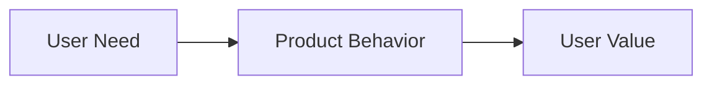

## Purpose

Describe the product change, feature, or project this PRD defines.

This section should answer:

- What is being built?
- Who is it for?
- What problem does it solve?
- Why is this worth building now?

## Problem Statement

Explain the current problem clearly.

Focus on user pain, workflow friction, missing capability, or decision pressure. Avoid solution details unless they are necessary to explain the problem.

## Goals

List the product outcomes this work must achieve.

- {User-facing or product goal}
- {User-facing or product goal}
- {User-facing or product goal}

## Non-goals

List reasonable expectations that are intentionally out of scope.

- {Out-of-scope capability}
- {Out-of-scope capability}

## Users and Use Cases

Describe the users, actors, or workflows this work supports.

| User / Actor | Need | Notes |
|---|---|---|
| {User or actor} | {What they need to accomplish} | {Relevant context} |
| {User or actor} | {What they need to accomplish} | {Relevant context} |

## Current State

Describe how the workflow or system works today.

Use this section only when the current behavior matters for understanding the requirement.

Intentionally empty: no current-state context is needed for this PRD.

## Proposed Solution

Describe the intended solution at a product level.

This section should explain what the user experiences and what the system provides. Avoid implementation details unless they constrain the user experience or requirements.

*Replace with the real product or workflow overview when a diagram improves clarity.*

## User Experience

Describe the expected user experience.

### Flow: {Flow name}

1. {User action}
2. {System response}
3. {User result}

### UX Rules

- {Interaction rule}
- {Interaction rule}
- {Interaction rule}

## Functional Requirements

List required behaviors the product must support.

| ID | Requirement | Priority | Notes |
|---|---|---:|---|
| FR-1 | {Required behavior} | Must | {Clarification or boundary} |
| FR-2 | {Required behavior} | Must | {Clarification or boundary} |
| FR-3 | {Required behavior} | Should | {Clarification or boundary} |

## Data Requirements

Describe product-level data requirements.

This section should explain what information the feature needs, produces, displays, or preserves. Do not turn this into an implementation schema.

| Data | Purpose | Notes |
|---|---|---|
| {Data concept} | {Why it is needed} | {Constraint, source, or ownership note} |
| {Data concept} | {Why it is needed} | {Constraint, source, or ownership note} |

Intentionally empty: this PRD does not introduce meaningful product-level data requirements.

## Rules and Constraints

Describe rules the solution must obey.

Use this section for product rules, business rules, workflow constraints, display constraints, or assumptions that affect behavior.

- {Rule or constraint}
- {Rule or constraint}
- {Rule or constraint}

## Edge Cases

List edge cases that materially affect product behavior.

Do not invent low-value edge cases. Leave this section empty when the functional requirements already cover normal failure or boundary behavior.

| Case | Expected behavior |
|---|---|
| {Edge case} | {Expected result} |
| {Edge case} | {Expected result} |

Intentionally empty: no high-value edge cases currently identified.

## Acceptance Criteria

Define how completion is verified.

Use user-observable outcomes where possible.

- [ ] {Acceptance criterion}
- [ ] {Acceptance criterion}
- [ ] {Acceptance criterion}

## Rollout / Migration Notes

Describe how this change is introduced.

Use this section only when rollout, migration, backfill, compatibility, or transition behavior matters.

Intentionally empty: no rollout or migration notes are needed for this PRD.

## Dependencies

List dependencies that affect delivery or product behavior.

| Dependency | Why it matters | Status |
|---|---|---|
| {Dependency} | {Reason} | {Known/unknown/blocked/ready} |
| {Dependency} | {Reason} | {Known/unknown/blocked/ready} |

Intentionally empty: no delivery-impacting dependencies currently identified.

## Open Questions

Intentionally empty: no meaningful unresolved product questions currently identified.

## Known Limitations

Intentionally empty: no high-value product limitations currently identified.

## Notes

- This is a product requirements document, not an implementation plan.
- Focus on user value, product behavior, scope boundaries, and acceptance criteria.
- Do not restate architecture, code structure, or detailed implementation unless it constrains the product requirement.
- Leave sections empty when there is no high-value information to add.
