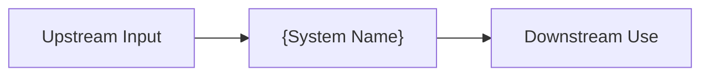
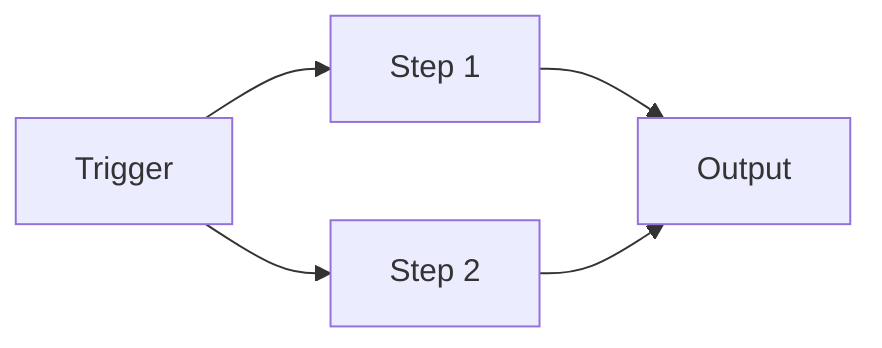
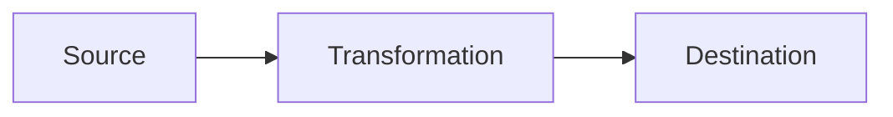
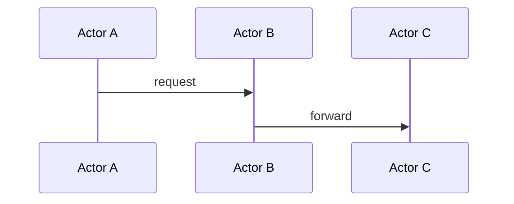

## Overview

Describe what the system does, why it exists, what problem it solves, and where it fits in the larger application.

*Replace with the real system context diagram.*

## Goals

- {Architectural goal with a clear design pressure}
- {Architectural goal with a clear design pressure}
- {Architectural goal with a clear design pressure}

## Non-goals

- {Reasonable expectation that is intentionally out of scope}
- {Reasonable expectation that is intentionally out of scope}

## Design Constraints

- {Hard boundary the architecture must obey}
- {Hard boundary the architecture must obey}
- {Hard boundary the architecture must obey}

## Key Decisions

### {Decision title}

**Decision:** {What was chosen}

**Rationale:** {Why this choice was made}

**Rejected alternatives:**

| Alternative | Why it was rejected |
|---|---|
| {Alternative A} | {Reason} |
| {Alternative B} | {Reason} |

## System Boundaries

### Owned by this system

- {Responsibility this system controls}
- {Responsibility this system controls}

### Not owned by this system

- {Out-of-scope area that belongs elsewhere}
- {Out-of-scope area that belongs elsewhere}

### Depends on but does not control

- {Dependency and contract expectation}
- {Dependency and contract expectation}

## System Operation

### Owned Processes

Describe workflows this system is authoritative for.

*Describe processes, not methods or files.*

### Process: {Name}

**Purpose:** {Why this process exists}

**Trigger:** {What starts the process}

**High-level flow:**

1. {Step}
2. {Step}
3. {Step}

**Important design notes:**

- {Architecture-level behavior or rule}
- {Architecture-level behavior or rule}

### Owned Data

Describe data this system is authoritative for.

| Data | Why it exists | Ownership notes |
|---|---|---|
| {Data object} | {Purpose} | {Boundary and authority} |
| {Data object} | {Purpose} | {Boundary and authority} |

### Data Flows

Describe how meaningful data moves through the system.

*Focus on what moves where and why.*

### Flow: {Name}

1. {Step}
2. {Step}
3. {Step}

### Flow notes

- {Important flow rule}
- {Important flow rule}

## Integration Points

| Integration | Direction | Purpose | Notes |
|---|---:|---|---|
| {System or file} | {Read/Write/Bidirectional} | {Why integration exists} | {Contract details} |
| {System or file} | {Read/Write/Bidirectional} | {Why integration exists} | {Contract details} |

## Important Behaviors

### {Behavior name}

{Architecture-relevant behavior that is easy to misunderstand from code alone.}

### {Behavior name}

{Architecture-relevant behavior that is easy to misunderstand from code alone.}

## Runtime Sequences

Intentionally empty: no architecture-critical runtime sequences currently identified.

### Sequence: {Name}

*Use only when sequence detail is architecture-critical.*

**When this happens:** {Triggering scenario}

**Why this sequence matters:** {Architecture impact}

**High-level sequence:**

1. {Step}
2. {Step}
3. {Step}

**Design notes:**

- {Constraint, tradeoff, or behavior note}

## Observability and Debugging

### How to inspect the system

- {Verification action}
- {Verification action}

### Useful debugging surfaces

| Surface | Use |
|---|---|
| {Tool/file} | {What it helps verify} |
| {Tool/file} | {What it helps verify} |

## Known Limitations

Intentionally empty: no meaningful known limitations currently identified.

## Open Questions

Intentionally empty: no meaningful unresolved architecture questions currently identified.

## Notes

- This is an architecture overview, not an implementation reference.
- Do not restate code that is easy to discover directly from implementation.
- Leave sections empty when there is no high-value information to add.
- Use [Documentation Style Guide](./documentation-style-guide.md) for writing rules.
- Use [Documentation Markdown Contract](./documentation-md-contract.md) for page-authoring requirements.
